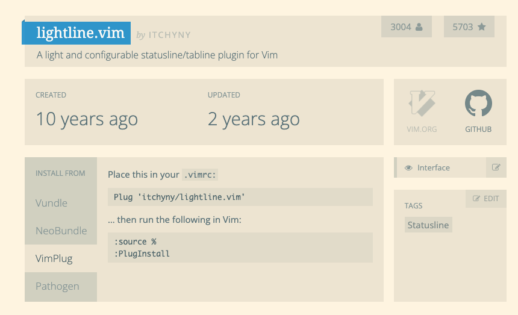

## 一、vim 常用插件管理工具
* Vim-plug和Vundle都是流行的Vim插件管理器，用于简化在Vim编辑器中安装、更新和管理插件的过程；
* 提供了简单的配置方式和自动化工具来帮助用户管理Vim插件；

### 1，Vim-plug
* Vim-plug 是一个轻量级、快速且易于使用的Vim插件管理器，它的设计目标是保持简单性和性能；
* Vim-plug使用类似于Git的语法来指定插件来源，并可以按需加载插件，以避免对Vim的启动速度产生负面影响；
* 要使用Vim-plug，在Vim的配置文件（如~/.vimrc）中添加一些简单的配置即可，然后运行Vim-plug命令来安装和更新插件；

### 2，Vundle
* Vundle（Vim Bundle）是一个流行的Vim插件管理器，它的目标是通过简化配置和操作来提供轻松的插件管理体验；
* Vundle使用类似于Git的语法来指定插件来源，并提供了一组命令来安装、更新和删除插件；
* 在Vim的配置文件中，用户可以使用Vundle提供的特定语法来列出需要安装的插件，并通过运行Vundle命令来执行插件的安装和更新操作；

### 3，两者的区别
* 语法：Vim-plug和Vundle都使用类似于Git的语法来指定插件来源，但在某些细节上有所不同。
* 性能：Vim-plug在启动速度和加载插件上具有良好的性能特点，而Vundle相对较慢一些。
* 功能：Vim-plug提供了一些额外的功能，如并行安装、分组插件、按需加载等，而Vundle提供了一些其他的功能，如插件搜索等。
* 依赖：两者都依赖于 git 下载插件，所以使用该插件管理工具时，需要先安装 git。
* 社区：Vundle是一个成熟且广泛使用的插件管理器，有很多用户和社区支持。Vim-plug相对较新，但也有许多用户和活跃的开发者。

## 二、插件管理工具使用方式
* 以 Vim-plug 举例
### 1，安装
```bash
curl -fLo ~/.vim/autoload/plug.vim --create-dirs https://raw.githubusercontent.com/junegunn/vim-plug/master/plug.vim

```
### 2，配置
* 编辑 **~/.vimrc** 文件，添加以下内容即可；
```bash
call plug#begin('~/.vim/plugged')
      Plug 'itchyny/lightline.vim'
call plug#end()
```
* 必须以 **plug#begin('~/.vim/plugged')** 开头，以 **plug#end()** 结尾，中间填写需要安装的插件；
* **~/.vim/plugged** 表示存放插件的目录；
* 通过访问 **[vimawesome](https://vimawesome.com/)**，查找自己需要安装的插件；
* 例如安装 **lightline** 插件
  * 在搜索框查找 lightline，在左侧选择 **VimPlug** 侧边栏；
  * 复制 `Plug 'itchyny/lightline.vim'` 到 `plug#begin('~/.vim/plugged') 和 plug#end()` 中间；
  * 在 vim 命令行执行 `source % 和 PlugInstall` 即可；
  
<!-- &emsp;&emsp;这是一个空格的注释 -->
